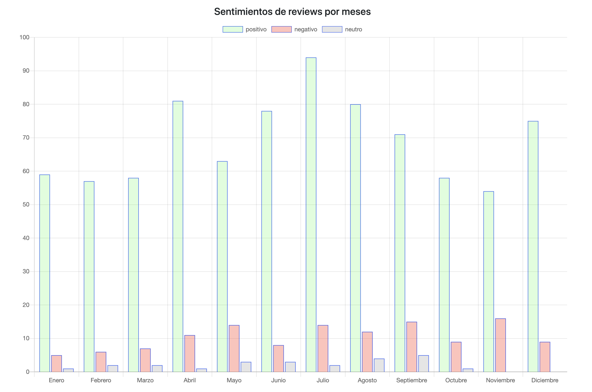
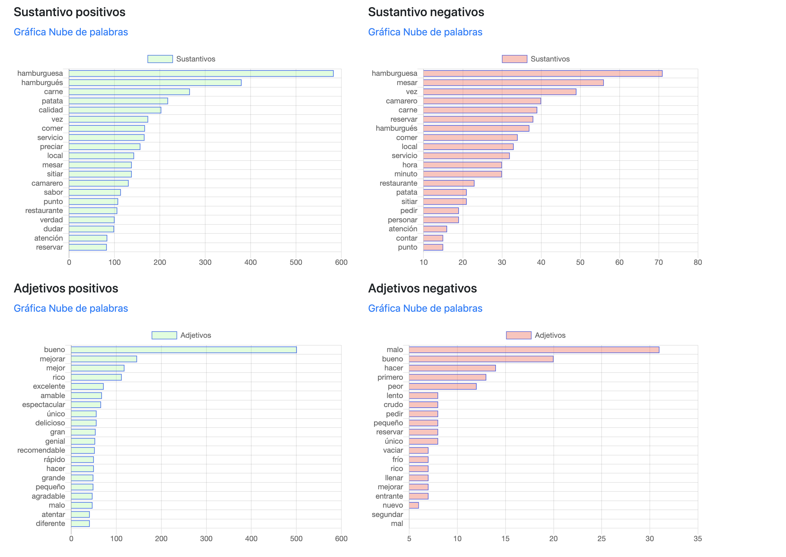
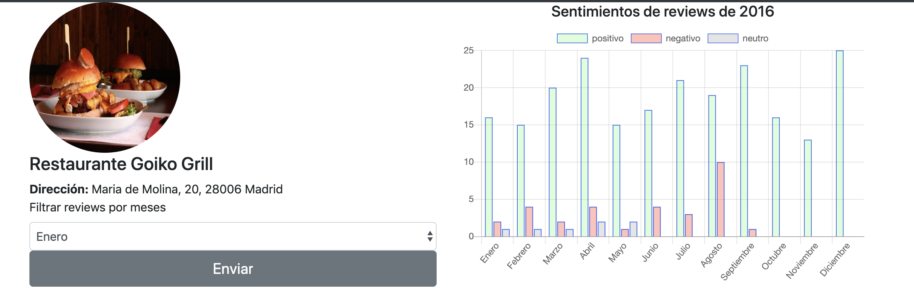
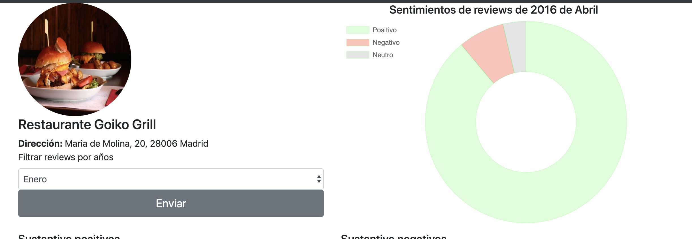

# summarization_sentiments

Aplicación web para el analisis de sentimiento de restaurantes de la página 
tripadvisor. En ella se puede recoger opiniones a tiempo real de restaurantes 
a través de tecnicas de Web Scraping, 
y obtener información rápida con gráficas de la librería Chart.js de Javascript

## Vistas

Vistas de un restaurante analizado:

Historial por años

Historial total por meses

Palabras más utilizadas

Filtrado por un año concreto

Filtrado por un mes de un año concreto

## Librerias

Las librerías utilizadas han sido las siguientes:

- Web Scraping
    - Selenium
    - Beautiful Soup
- Base de datos
    - Sqlite3
- Tratamiento del texto
    - Spacy
- Modelo de machine learning
    - Sklearn

## Estructura

La estructura del proyecto se divide en tres directorios.

### datasest

Directorio donde se encuentra los datasets para el entreno de sentimientos.

### sentiments_analysis

Directorio donde se emplea el clafisicador de machine learning
para el analisis de sentimientos. Sus ficheros:

- clean_dataset: se encarga de limpia el texto con técnicas de NLP de los
 ficheros .csv del directorio datasets.
 - train_model: se encarga de entrenar el modelo con lo datos limpiados
 para predecir el analisis de sentimientos.
 - filename.jobilb: modelo entrenado
 
 ### mysite
 
 Aplicación web escrita a través del framework Django. En el subdirectorio 
 sumtravel se encuentra la aplicación para hacer funcionar la aplicación web.
 Sus directorios son los siguientes
 
 ### bbdd
 
 Directorio donde se encuentra ficheros que se encargan de hacer querys a 
 la base de datos.
 
 ### scraping
 
 Directorio donde se encarga de realizar web scraping a la página de tripadvisor
 para recoger a tiempo real las opiniones de los usuarios.
 
 
### static

Directorio para la parte de frontend donde se encuentra imagenes, hojas de
estilos y scripts de javascript.

### Trabajo futuro

- Mejorar la estetica
- Optimizar los tiempos de carga
- Realiar un resumen de opiniones
- Añadir hoteles
